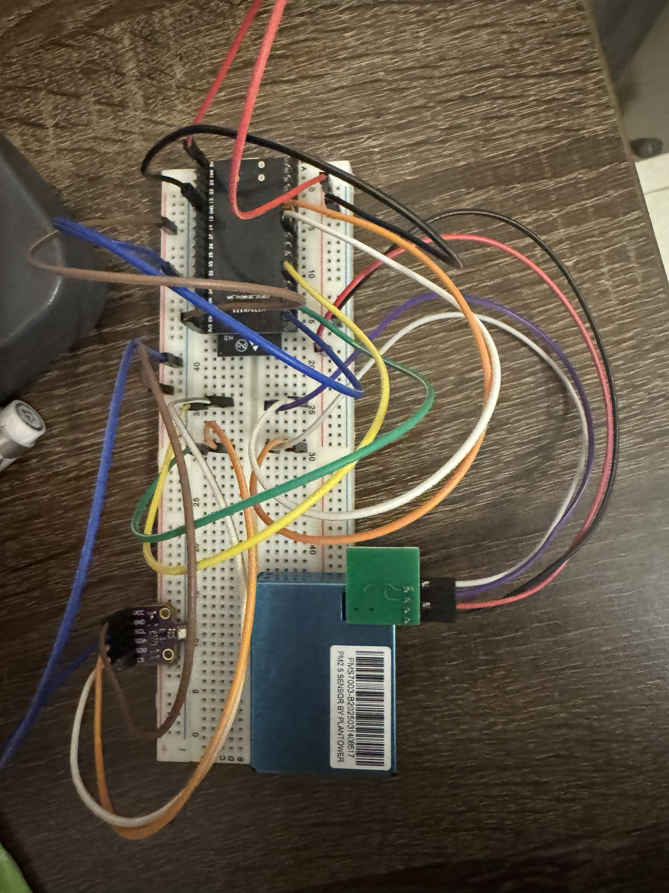
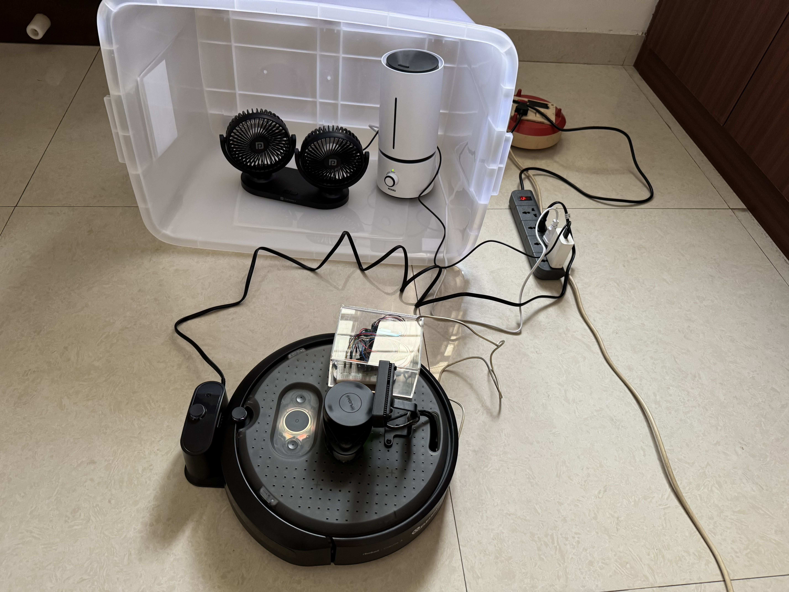
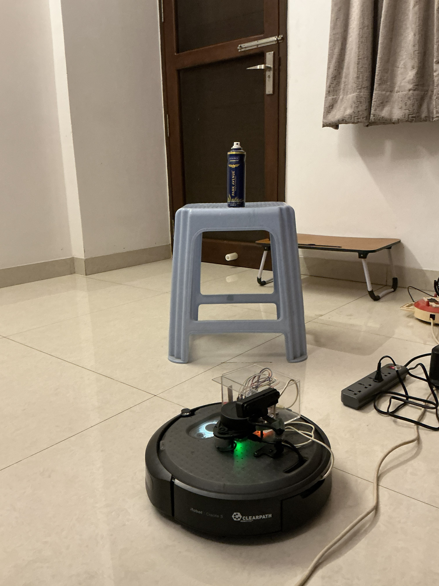
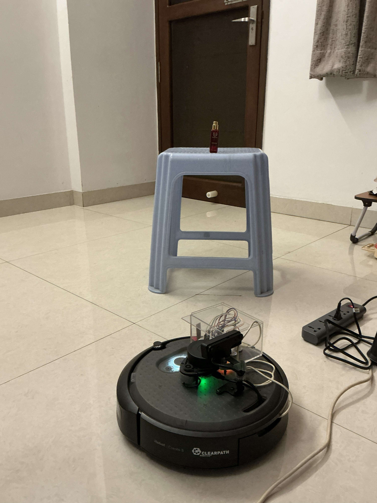
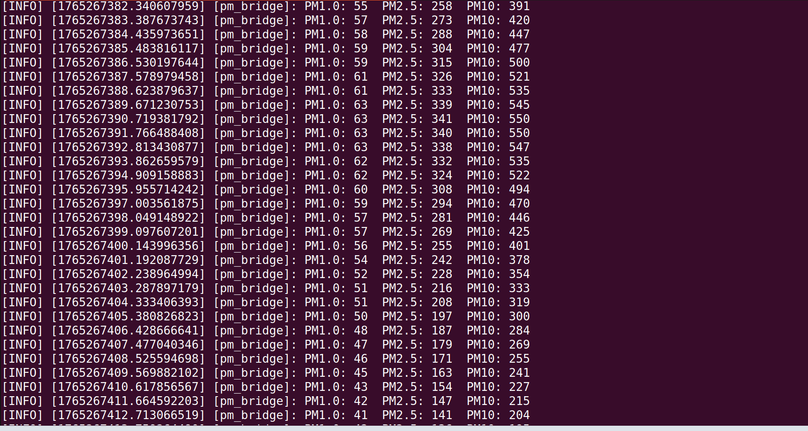
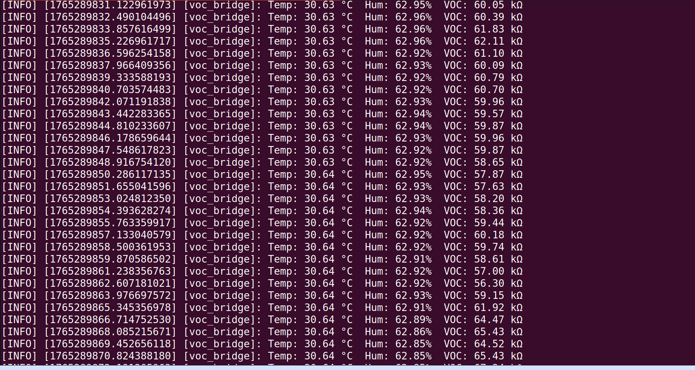
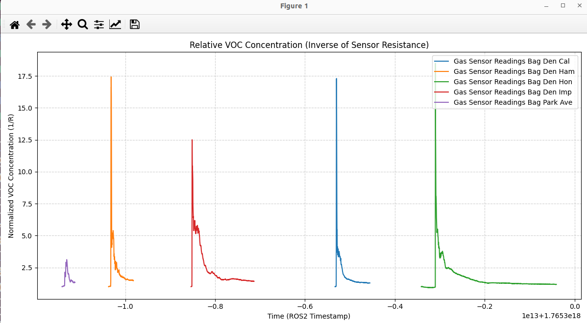

# Sensor Integration – Dust & Gas (TurtleBot4 Lite)
**ROS2 · Arduino · TurtleBot4 Lite · PMS7003 · VOC Sensor**

Real hardware integration of dust and gas sensors into a ROS2-based TurtleBot4 Lite platform. Demonstrates live environmental sensing, real-time data pipelines, and hazard detection capability on physical hardware — extending the simulation-based sensor work from the MSc multi-agent project.

---

## Overview

Two sensor modalities were integrated and validated on the TurtleBot4 Lite:

- **Dust sensor (PMS7003)** — particulate matter detection (PM1.0, PM2.5, PM10) using a controlled dust plume proxy
- **Gas sensor (VOC-based)** — volatile organic compound detection with real-time threshold-based response

Both sensors are integrated via Arduino into the ROS2 pipeline, with real-time data streaming into the robotics system.

---

## Dust Sensor Integration

### Hardware Setup

- **Sensor:** PMS7003 particulate matter sensor
- **Interface:** Arduino → serial → ROS2 pipeline
- Dust plume proxy generated using a humidifier within a semi-enclosed acrylic chamber
- Humidifier nozzle positioned approximately 8–10 cm above the floor, aligned with sensor intake
- Chamber front kept slightly open towards the robot to prevent plume loss
- TurtleBot4 Lite positioned 10–15 cm from the chamber
- Camera placed 1–1.5 m away at robot height for monitoring
- Natural daylight and room lighting
- Fan used to stabilise airflow within the chamber

### Implementation

- Real-time data pipeline: Arduino → ROS2 → processing layer
- Conversion of raw readings into relative concentration and density metrics
- Continuous streaming of environmental data into the robotics system

### Outcome

- Demonstrated detection and quantification of dust presence
- Enabled real-time environmental awareness on physical hardware
- Established foundation for future autonomous planning and response

---

## Gas Sensor Integration

### Hardware Setup

- **Sensor:** VOC-based gas sensor
- **Interface:** Arduino → serial → ROS2 pipeline
- Gas source (perfume / deodorant) placed approximately 1 metre from robot path
- Robot traversed path and stopped upon detection
- Multiple test cases conducted across different gas sources

### Implementation

- Real-time sensor reading pipeline
- Interpretation of readings into gas presence levels
- Continuous monitoring integrated into system workflow

### Outcome

- Demonstrated live gas detection capability on physical hardware
- Validated responsiveness to environmental changes
- Produced comparative results across multiple gas sources

---

## Setup & Hardware

<table>
  <tr>
    <td align="center">
       
      Circuit Integration
    </td>
    <td align="center">
       
      Dust Sensor Setup
    </td>
    <td align="center">
       
      Gas Sensor (Deodorant)
    </td>
    <td align="center">
       
      Gas Sensor (Perfume)
    </td>
  </tr>
</table>

---

## Results

### Sensor Logs

<table>
  <tr>
    <td align="center">
       
      Dust Sensor Log
    </td>
    <td align="center">
       
      Gas Sensor Log
    </td>
  </tr>
</table>

### Gas Sensor Analysis

---

## Key Technical Takeaways

- Arduino-based sensor integration within a ROS2 robotics system
- Real-time data acquisition and processing pipelines via serial communication
- Handling non-visual sensing modalities (dust and gas) alongside standard robot sensors
- Designing systems for environmental awareness and future autonomous response

---

## Tech Stack

| Category | Technologies |
|----------|-------------|
| Robotics Framework | ROS2 |
| Hardware | TurtleBot4 Lite, Raspberry Pi, Arduino |
| Sensors | PMS7003 (dust / PM), VOC gas sensor |
| Interface | Serial communication (Arduino → ROS2) |
| Language | Python |
